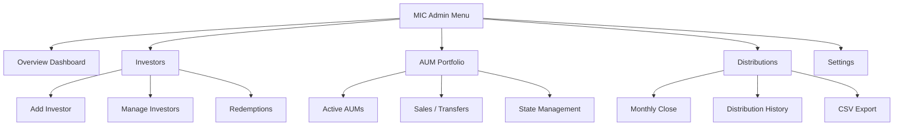

# MIC Admin Module — UI/UX Design Document

> **Location:** `dashboard/admin/mic`  
> **Target Users:** Admin and MIC staff (primary), MIC investors (secondary, read-only)  
> **Design Pattern:** Data tables with slide-out sheets for data entry/modification

---

## - [ ] Navigation Structure

The MIC Admin module uses a **multi-section dropdown menu** accessible from the admin sidebar. All sections are nested under `/dashboard/admin/mic/`.



---

## - [ ] Live Demo Modal (Stakeholder Walkthrough)

**Component:** `MICLiveDemoModal`

**User Story:** As an admin, I need to demonstrate the full MIC lifecycle to stakeholders by stepping through a simulated 1-month period, populating the Formance ledger with test transactions at each phase.

**Trigger Location:** Persistent button in the MIC Admin header (visible on all MIC pages)

**Trigger UI:**

```
┌────────────────────────────────────────────────────────────────┐
│ 🎯 [Live Demo]  │  Admin > MIC Management                      │
└────────────────────────────────────────────────────────────────┘
```

---

### - [ ] Modal Structure

**Component:** `MICLiveDemoModal`

**Modal Layout:**

```
┌──────────────────────────────────────────────────────────────────────┐
│                      MIC Lifecycle Demo                         [X]  │
├──────────────────────────────────────────────────────────────────────┤
│                                                                      │
│  ┌────────────────────────────────────────────────────────────────┐  │
│  │                      PROGRESS STEPPER                          │  │
│  │  [A0]──[B1]──[C]──[D]──[E]──[F]──[H]──[H4]──[H5]              │  │
│  │   ●     ○     ○    ○    ○    ○    ○     ○     ○               │  │
│  │  Done                                                          │  │
│  └────────────────────────────────────────────────────────────────┘  │
│                                                                      │
│  ┌────────────────────────────────────────────────────────────────┐  │
│  │  CURRENT PHASE: A0 - Investor Subscribe                        │  │
│  │  ──────────────────────────────────────────────────────────    │  │
│  │                                                                │  │
│  │  Description:                                                  │  │
│  │  An investor subscribes $250,000 to the MIC fund.             │  │
│  │  Capital units (MICCAP) are minted to their position.         │  │
│  │                                                                │  │
│  │  ┌──────────────────────────────────────────────────────────┐  │  │
│  │  │             TRANSACTION PREVIEW                          │  │  │
│  │  ├──────────────────────────────────────────────────────────┤  │  │
│  │  │  ┌─────────────────┐         ┌─────────────────┐         │  │  │
│  │  │  │ demo:ext:inv1   │ ──$250k─→ │ demo:mic:cash  │         │  │  │
│  │  │  │ External Inv    │           │ MIC Cash       │         │  │  │
│  │  │  └─────────────────┘           └─────────────────┘         │  │  │
│  │  │                                                            │  │  │
│  │  │  ┌─────────────────┐         ┌─────────────────┐         │  │  │
│  │  │  │ demo:mic:cap:   │ ─250k u─→ │ demo:mic:cap:  │         │  │  │
│  │  │  │ treasury        │           │ inv1           │         │  │  │
│  │  │  └─────────────────┘           └─────────────────┘         │  │  │
│  │  └──────────────────────────────────────────────────────────┘  │  │
│  │                                                                │  │
│  │  Accounts Created/Modified:                                   │  │
│  │  • demo:ext:inv1 — External investor wallet                   │  │
│  │  • demo:mic:FLMIC:cash — MIC cash account                     │  │
│  │  • demo:mic:FLMIC:capital:treasury — MICCAP treasury          │  │
│  │  • demo:mic:FLMIC:capital:investor:inv1 — Investor position   │  │
│  │                                                                │  │
│  └────────────────────────────────────────────────────────────────┘  │
│                                                                      │
│  ┌────────────────────────────────────────────────────────────────┐  │
│  │  LEDGER STATE (Live)                                           │  │
│  │  ┌──────────────────────────────┬──────────────────────────┐  │  │
│  │  │ Account                       │ Balance                  │  │  │
│  │  ├──────────────────────────────┼──────────────────────────┤  │  │
│  │  │ demo:mic:FLMIC:cash          │ $0.00 → $250,000.00      │  │  │
│  │  │ demo:mic:FLMIC:capital:inv1  │ 0 → 250,000 MICCAP       │  │  │
│  │  └──────────────────────────────┴──────────────────────────┘  │  │
│  └────────────────────────────────────────────────────────────────┘  │
│                                                                      │
├──────────────────────────────────────────────────────────────────────┤
│   [Reset Demo]            [← Previous]  [Execute Step]  [Next →]     │
└──────────────────────────────────────────────────────────────────────┘
```

---

### - [ ] Demo Phases (9 Steps)

Each phase corresponds to a subgraph in the [e2eSampleFlow.mermaid](./e2eSampleFlow.mermaid) diagram.

| Phase  | Name                        | Description                                     | Ledger Transactions                          |
| ------ | --------------------------- | ----------------------------------------------- | -------------------------------------------- |
| **A0** | Investor Subscribe          | Investor contributes $250,000 to MIC            | Cash inflow + MICCAP unit mint               |
| **B1** | Origination (Netted Fee)    | MIC funds mortgage M123, nets 1% lending fee    | Fund principal, collect fee, allocate shares |
| **C**  | Listing Fee                 | MIC pays 0.5% listing fee to platform           | Fee accrual + settlement                     |
| **D**  | Pre-Sale Accrual            | Accrue interest and servicing to MIC (pre-sale) | Interest + servicing accrual                 |
| **E**  | Mid-Month Sale (80%)        | MIC sells 80% of mortgage to buyer              | Share transfer + cash proceeds               |
| **F**  | Post-Sale Accrual           | Accrue interest split 20/80 MIC/Buyer           | Pro-rata interest accrual                    |
| **H**  | Month-End Settlement        | Borrower PAD payment, settle all accruals       | PAD → settlements                            |
| **H4** | Fund Management Fee         | Accrue and pay fund management fee              | Fee accrual + payment                        |
| **H5** | MIC Distribution (Net-Zero) | Distribute all MIC cash to investors            | Distribution + net-zero validation           |

---

### - [ ] Phase Detail Components

#### - [ ] Phase A0: Investor Subscribe

**Description:** An investor subscribes capital to the MIC fund. Cash is deposited and MICCAP units are minted.

**Transactions:**

1. `demo:ext:inv1` → `demo:mic:FLMIC:cash` : **CAD $250,000**
2. `demo:mic:FLMIC:capital:treasury` → `demo:mic:FLMIC:capital:investor:inv1` : **250,000 MICCAP-FLMIC/0**

**Expected State After:**

- MIC Cash: $250,000
- Investor 1 MICCAP: 250,000 units
- Investor 1 Ownership: 100%

---

#### - [ ] Phase B1: Origination (Netted Fee)

**Description:** MIC funds mortgage M123 for $100,000 principal. 1% lending fee ($1,000) is netted from borrower proceeds.

**Transactions:**

1. `demo:mic:FLMIC:cash` → `demo:ext:borrower:M123` : **CAD $100,000** (principal)
2. `demo:ext:borrower:M123` → `demo:mic:FLMIC:cash` : **CAD $1,000** (1% lending fee)
3. `demo:mortgage:M123:share:treasury` → `demo:investors:MIC_FLMIC:mortgage:M123:position` : **100,000 MORT-M123/0** (100% ownership)

**Expected State After:**

- MIC Cash: $151,000 ($250k - $100k + $1k)
- MIC owns 100% of mortgage M123
- Lending fee income: $1,000

---

#### - [ ] Phase C: Listing Fee

**Description:** MIC incurs 0.5% listing fee on the mortgage principal.

**Transactions:**

1. `demo:mic:FLMIC:cash` → `demo:mic:FLMIC:expense:listing_fee_accrued` : **CAD $500** (accrue)
2. `demo:mic:FLMIC:expense:listing_fee_accrued` → `demo:ext:platform` : **CAD $500** (pay)

**Expected State After:**

- MIC Cash: $150,500
- Listing fee paid to platform: $500

---

#### - [ ] Phase D: Pre-Sale Accrual

**Description:** Before mid-month sale, accrue interest and servicing fees to MIC as 100% owner.

**Transactions:**

1. `demo:mortgage:M123:interest:receivable` → `demo:accrued:mortgage:M123:investor:MIC_FLMIC` : **CAD $416.67** (half-month interest at 10% annual)
2. `demo:mortgage:M123:interest:receivable` → `demo:mic:FLMIC:income:servicing_fee` : **CAD $41.67** (0.5% servicing, half-month)

**Expected State After:**

- MIC accrued interest: $416.67
- MIC accrued servicing: $41.67

---

#### - [ ] Phase E: Mid-Month Sale (80%)

**Description:** MIC sells 80% of mortgage to external buyer. Pre-condition: accrual boundary enforced.

**Transactions:**

1. `demo:investors:MIC_FLMIC:mortgage:M123:position` → `demo:investors:buyer1:mortgage:M123:position` : **80,000 MORT-M123/0** (80% transfer)
2. `demo:ext:buyer1` → `demo:mic:FLMIC:cash` : **CAD $80,000** (sale proceeds)
3. (Future servicing fee now routes to management for sold portion)

**Expected State After:**

- MIC Cash: $230,500
- MIC owns 20% of M123
- Buyer owns 80% of M123
- Servicing fee recipient flips for 80% to management

---

#### - [ ] Phase F: Post-Sale Accrual

**Description:** For remainder of month, accrue interest split 20% to MIC, 80% to Buyer.

**Transactions:**

1. `demo:mortgage:M123:interest:receivable` → `demo:accrued:mortgage:M123:investor:MIC_FLMIC` : **CAD $83.33** (20% of half-month)
2. `demo:mortgage:M123:interest:receivable` → `demo:accrued:mortgage:M123:investor:buyer1` : **CAD $333.33** (80% of half-month)
3. `demo:mortgage:M123:interest:receivable` → `demo:ext:mgmt:servicing` : **CAD $33.33** (servicing on sold portion)

**Expected State After:**

- MIC total accrued interest: $500 ($416.67 + $83.33)
- Buyer accrued interest: $333.33
- Management servicing accrued: $33.33

---

#### - [ ] Phase H: Month-End Settlement

**Description:** Borrower makes PAD payment. All accrued amounts settle to cash/wallets.

**Transactions:**

1. `demo:ext:borrower:M123` → `demo:mortgage:M123:collect` : **CAD $833.33** (interest paid)
2. `demo:mortgage:M123:collect` → `demo:mortgage:M123:interest:receivable` : **CAD $833.33** (settle receivable)
3. `demo:mic:FLMIC:income:servicing_fee` → `demo:ext:mgmt:servicing` : **CAD $33.33** (servicing to mgmt)
4. `demo:accrued:mortgage:M123:investor:MIC_FLMIC` → `demo:mic:FLMIC:cash` : **CAD $500** (MIC interest settled)
5. `demo:accrued:mortgage:M123:investor:buyer1` → `demo:ext:buyer1:wallet` : **CAD $333.33** (Buyer payout)

**Expected State After:**

- MIC Cash: $231,000 ($230,500 + $500)
- Buyer wallet: +$333.33
- All accruals cleared

---

#### - [ ] Phase H4: Fund Management Fee

**Description:** Accrue and pay monthly fund management fee (assume 1% annual = ~$2,083/month on $250k).

**Transactions:**

1. `demo:mic:FLMIC:cash` → `demo:mic:FLMIC:expense:fund_mgmt_accrued` : **CAD $208.33** (accrue)
2. `demo:mic:FLMIC:expense:fund_mgmt_accrued` → `demo:ext:fund_manager` : **CAD $208.33** (pay)

**Expected State After:**

- MIC Cash: $230,791.67
- Fund management fee paid: $208.33

---

#### - [ ] Phase H5: MIC Distribution (Net-Zero)

**Description:** Distribute all remaining MIC cash to investors pro-rata. Verify net-zero invariant.

**Transactions:**

1. `demo:mic:FLMIC:cash` → `demo:mic:FLMIC:distribution:payable` : **CAD $230,791.67** (declare)
2. `demo:mic:FLMIC:distribution:payable` → `demo:ext:inv1:wallet` : **CAD $230,791.67** (pay to 100% owner)
3. (Any rounding remainder → `demo:mic:FLMIC:rounding`)

**Expected State After:**

- MIC Cash: **$0.00** ✓ (Net-zero invariant satisfied)
- Investor 1 receives: $230,791.67

**Invariant Check:** `demo:mic:FLMIC:cash == 0`

---

### - [ ] Account Naming Convention (Test Data)

All demo accounts use the **`demo:`** prefix to clearly identify test data:

| Pattern                       | Example                                           | Purpose              |
| ----------------------------- | ------------------------------------------------- | -------------------- |
| `demo:ext:<entity>`           | `demo:ext:inv1`, `demo:ext:borrower:M123`         | External parties     |
| `demo:mic:<MIC_ID>:cash`      | `demo:mic:FLMIC:cash`                             | MIC cash account     |
| `demo:mic:<MIC_ID>:capital:*` | `demo:mic:FLMIC:capital:investor:inv1`            | MICCAP positions     |
| `demo:mic:<MIC_ID>:expense:*` | `demo:mic:FLMIC:expense:listing_fee_accrued`      | Expense accruals     |
| `demo:mic:<MIC_ID>:income:*`  | `demo:mic:FLMIC:income:servicing_fee`             | Income accruals      |
| `demo:mortgage:<ID>:*`        | `demo:mortgage:M123:interest:receivable`          | Mortgage accounts    |
| `demo:investors:*`            | `demo:investors:MIC_FLMIC:mortgage:M123:position` | Investor positions   |
| `demo:accrued:*`              | `demo:accrued:mortgage:M123:investor:MIC_FLMIC`   | Accrued entitlements |

> [!IMPORTANT]
> The `demo:` prefix ensures test transactions are easily identifiable and can be filtered/excluded in production queries.

---

### - [ ] Component Specifications

#### - [ ] Header Trigger Button

**Component:** `LiveDemoTrigger`

**File:** `components/admin/mic/LiveDemoTrigger.tsx`

**Appearance:**

- Pill-shaped button with play icon
- Subtle pulsing animation when demo is active
- Badge shows current step (e.g., "3/9") when demo in progress

```tsx
// Button states
- Idle: "🎯 Live Demo"
- Active: "🎯 Demo (3/9)" with progress indicator
- Demo Complete: "🎯 Demo ✓" with checkmark
```

---

#### - [ ] Progress Stepper

**Component:** `DemoProgressStepper`

**File:** `components/admin/mic/demo/DemoProgressStepper.tsx`

**Features:**

- Horizontal stepper showing all 9 phases
- Completed steps: filled circle with checkmark
- Current step: highlighted with pulse animation
- Future steps: empty circles
- Step labels on hover

---

#### - [ ] Phase Card

**Component:** `DemoPhaseCard`

**File:** `components/admin/mic/demo/DemoPhaseCard.tsx`

**Sections:**

1. **Phase Header:** Step number, name, status badge
2. **Description:** Natural language explanation
3. **Transaction Preview:** Visual flow diagram (mermaid-style)
4. **Accounts List:** Accounts that will be created/modified
5. **Expected State:** Post-execution balances

---

#### - [ ] Ledger State Panel

**Component:** `DemoLedgerStatePanel`

**File:** `components/admin/mic/demo/DemoLedgerStatePanel.tsx`

**Features:**

- Live table of all `demo:*` accounts
- Before/after balance comparison
- Auto-refresh after step execution
- Expandable for full account tree view

---

#### - [ ] Control Bar

**Component:** `DemoControlBar`

**File:** `components/admin/mic/demo/DemoControlBar.tsx`

**Actions:**
| Button | Action | Confirmation? |
|--------|--------|---------------|
| Reset Demo | Delete all `demo:*` accounts | Yes (destructive) |
| ← Previous | Navigate to previous step (view only) | No |
| Execute Step | Run current step's ledger transactions | Yes |
| Next → | Navigate to next step | No |

---

### - [ ] New Components Summary (Demo Module)

| Component                | File                                                   | Purpose                       |
| ------------------------ | ------------------------------------------------------ | ----------------------------- |
| `MICLiveDemoModal`       | `components/admin/mic/demo/MICLiveDemoModal.tsx`       | Main modal container          |
| `LiveDemoTrigger`        | `components/admin/mic/LiveDemoTrigger.tsx`             | Header trigger button         |
| `DemoProgressStepper`    | `components/admin/mic/demo/DemoProgressStepper.tsx`    | 9-step progress indicator     |
| `DemoPhaseCard`          | `components/admin/mic/demo/DemoPhaseCard.tsx`          | Phase description + preview   |
| `DemoTransactionPreview` | `components/admin/mic/demo/DemoTransactionPreview.tsx` | Visual transaction flow       |
| `DemoLedgerStatePanel`   | `components/admin/mic/demo/DemoLedgerStatePanel.tsx`   | Live account balances         |
| `DemoControlBar`         | `components/admin/mic/demo/DemoControlBar.tsx`         | Navigation + execute controls |

---

## - [ ] Screens

### - [ ] 1. MIC Overview Dashboard

**Route:** `/dashboard/admin/mic`

**User Story:** As an admin, I need a high-level view of MIC fund health, so I can quickly assess fund status and identify actions needed.

**Description:**  
Landing page showing key MIC metrics at a glance with quick action buttons. Follows the existing admin dashboard pattern with metric cards and summary widgets.

**UI Components:**
| Component | Description |
|-----------|-------------|
| `MICFundMetricsRow` | 4-column grid showing Total AUM, Total Capital, Investor Count, and Cash Balance |
| `MICCashHealthCard` | Visual indicator showing current cash position vs net-zero target |
| `RecentActivityFeed` | Timeline of recent MIC transactions (investor adds, AUM changes, distributions) |
| `PendingActionsCard` | Cards showing items requiring attention (pending redemptions, monthly close) |
| `QuickActionsBar` | Buttons for common actions: Add Investor, Add AUM, Run Distribution |

**Appearance:**

- Header with breadcrumb: `Admin > MIC Management`
- 4-column metric card row at top (consistent with existing admin dashboard)
- 2-column layout below: left for activity feed, right for pending actions
- Quick actions bar fixed at bottom or as floating action buttons

---

### - [ ] 2. Investor Management

**Route:** `/dashboard/admin/mic/investors`

**User Story:** As an admin, I need to manage MIC investors including adding new investors, viewing their positions, and processing redemptions.

**Description:**  
Primary data table view showing all MIC investors with their capital positions, governance units, and status. Clicking a row opens a detail sheet.

**Sub-sections:**

- **All Investors** (default tab)
- **Pending Redemptions** (filtered view)
- **Governance Holders** (filtered view)

---

#### - [ ] 2.1 Investors Data Table

**Component:** `MICInvestorsTable`

**Columns:**
| Column | Type | Sortable | Description |
|--------|------|----------|-------------|
| Investor Name | Text + Avatar | ✓ | Link to investor profile |
| MICCAP Balance | Currency | ✓ | Capital units owned |
| Ownership % | Percentage | ✓ | Calculated from total MICCAP |
| Governance Units | Number | ✓ | MICGOV balance |
| Last Distribution | Date | ✓ | Date of last payout |
| Status | Badge | ✓ | Active, Pending Redemption, Frozen |
| Actions | Buttons | — | View, Edit, Redeem |

**Table Features:**

- Search/filter by investor name
- Filter by status
- Bulk select for batch operations
- Export to CSV

---

#### - [ ] 2.2 Add Investor Sheet

**Component:** `AddInvestorSheet`

**User Story (7.1):** As an admin, I need to add a new MIC investor and record their capital contribution.

**Trigger:** "Add Investor" button or row action

**Sheet Content:**

```
┌─────────────────────────────────────┐
│ ← Add New Investor                  │
├─────────────────────────────────────┤
│ Step 1: Investor Details            │
│ ┌─────────────────────────────────┐ │
│ │ Select Existing User     [▼]   │ │
│ │ — OR —                         │ │
│ │ Name: [________________]       │ │
│ │ Email: [_______________]       │ │
│ └─────────────────────────────────┘ │
│                                     │
│ Step 2: Capital Contribution        │
│ ┌─────────────────────────────────┐ │
│ │ Amount (CAD): [$__________]    │ │
│ │ Bank Confirmation: [Upload]    │ │
│ │ Deposit Date: [__/__/____]     │ │
│ └─────────────────────────────────┘ │
│                                     │
│ Step 3: Governance (Optional)       │
│ ┌─────────────────────────────────┐ │
│ │ Issue Governance Units? [  ]   │ │
│ │ Governance Class: [▼]          │ │
│ │ Units: [_______]               │ │
│ └─────────────────────────────────┘ │
│                                     │
│ Preview                             │
│ ┌─────────────────────────────────┐ │
│ │ MICCAP-FLMIC/0 to mint: X,XXX  │ │
│ │ Ownership after: X.XX%         │ │
│ └─────────────────────────────────┘ │
│                                     │
├─────────────────────────────────────┤
│        [Cancel]  [Confirm & Add]    │
└─────────────────────────────────────┘
```

**Fields:**

- Investor selection (existing user autocomplete or new user form)
- Capital contribution amount (CAD)
- Bank confirmation reference/upload
- Deposit date
- Optional: Governance unit allocation

**Validation:**

- Amount must be positive
- Bank confirmation required before confirmation
- Preview shows calculated MICCAP units and new ownership %

**On Submit:**

- Executes ledger transaction: `external:bank → mic:<MIC_ID>:cash`
- Mints MICCAP units to investor position
- Optional: Mints governance units
- Updates cap table automatically

---

#### - [ ] 2.3 Investor Detail Sheet

**Component:** `InvestorDetailSheet`

**Trigger:** Row click on investors table

**Sections:**

1. **Header:** Investor name, email, status badge
2. **Position Summary:**
   - MICCAP balance
   - Ownership percentage (pie chart mini)
   - Governance units
   - Total contributed capital
3. **Transaction History:** Table of all investor transactions
4. **Distribution History:** List of all distributions received
5. **Actions:** Edit, Initiate Redemption

---

#### - [ ] 2.4 Investor Redemption Sheet

**Component:** `InvestorRedemptionSheet`

**User Story (7.2):** As an admin, I need to process an investor's capital redemption (full or partial exit).

**Trigger:** "Redeem" button on investor row/detail

**Sheet Content:**

```
┌─────────────────────────────────────┐
│ ← Process Redemption                │
├─────────────────────────────────────┤
│ Investor: John Doe                  │
│ Current Position                    │
│ ┌─────────────────────────────────┐ │
│ │ MICCAP Balance: 50,000          │ │
│ │ Ownership: 5.00%                │ │
│ │ Current Value: $50,000 CAD      │ │
│ └─────────────────────────────────┘ │
│                                     │
│ Redemption Details                  │
│ ┌─────────────────────────────────┐ │
│ │ Type: ○ Full  ○ Partial         │ │
│ │ Units to Redeem: [_______]      │ │
│ │ Redemption Date: [__/__/____]   │ │
│ └─────────────────────────────────┘ │
│                                     │
│ ⚠️ Pending Accruals Check           │
│ ┌─────────────────────────────────┐ │
│ │ Status: All accruals complete ✓ │ │
│ │ Last accrual: 2024-12-01        │ │
│ └─────────────────────────────────┘ │
│                                     │
│ Payout Details                      │
│ ┌─────────────────────────────────┐ │
│ │ Wallet Account: [___________]   │ │
│ │ Calculated Payout: $XX,XXX      │ │
│ └─────────────────────────────────┘ │
│                                     │
├─────────────────────────────────────┤
│      [Cancel]  [Process Redemption] │
└─────────────────────────────────────┘
```

**Pre-conditions Checked:**

- All accruals complete to redemption date
- Sufficient MIC cash available

**On Submit:**

- Burns investor MICCAP units
- Transfers cash from `mic:<MIC_ID>:cash` to investor wallet
- Updates cap table

---

### - [ ] 3. AUM Portfolio Management

**Route:** `/dashboard/admin/mic/aum`

**User Story:** As an admin, I need to view and manage mortgages (AUMs) owned by the MIC, including origination, sales, and state transitions.

**Description:**  
Data table showing all mortgages where MIC holds ownership, with filtering by ownership percentage and state.

---

#### - [ ] 3.1 AUM Portfolio Table

**Component:** `MICAUMTable`

**Columns:**
| Column | Type | Sortable | Description |
|--------|------|----------|-------------|
| Mortgage ID | ID Link | ✓ | Links to mortgage detail |
| Property Address | Text | ✓ | Truncated address |
| Principal | Currency | ✓ | Original principal amount |
| MIC Ownership | Percentage | ✓ | Current % owned by MIC |
| Interest Rate | Percentage | — | Annual rate |
| State | Badge | ✓ | Active, Default, Recovery |
| Accrued Interest | Currency | ✓ | Unpaid interest to date |
| Next Payment | Date | ✓ | Next PAD date |
| Actions | Buttons | — | View, List for Sale, Manage State |

**Filters:**

- Ownership: Full (100%), Partial (<100%), Any
- State: Active, Missed, Default, Recovery
- Date range for origination

---

#### - [ ] 3.2 Add New AUM Sheet

**Component:** `AddAUMSheet`

**User Story (7.3):** As an admin, I need to deploy MIC capital into a new mortgage (origination).

**Trigger:** "Add AUM" button

**Sheet Content:**

```
┌─────────────────────────────────────┐
│ ← Deploy Capital to AUM             │
├─────────────────────────────────────┤
│ Step 1: Select Mortgage             │
│ ┌─────────────────────────────────┐ │
│ │ Mortgage ID: [Search...]  [▼]   │ │
│ │ [Mortgage preview card]         │ │
│ └─────────────────────────────────┘ │
│                                     │
│ Step 2: Funding Details             │
│ ┌─────────────────────────────────┐ │
│ │ Principal (P): $___________     │ │
│ │ Lending Fee (1%): $_______ ✓    │ │
│ │ Net to Borrower: $________      │ │
│ └─────────────────────────────────┘ │
│                                     │
│ MIC Cash Check                      │
│ ┌─────────────────────────────────┐ │
│ │ Available: $XXX,XXX             │ │
│ │ After Funding: $XXX,XXX         │ │
│ │ Status: ✓ Sufficient funds      │ │
│ └─────────────────────────────────┘ │
│                                     │
│ Preview                             │
│ ┌─────────────────────────────────┐ │
│ │ MIC receives: 100% ownership    │ │
│ │ MORT-M123/0 shares: 100,000     │ │
│ │ Lending fee accrued: $1,000     │ │
│ └─────────────────────────────────┘ │
│                                     │
├─────────────────────────────────────┤
│       [Cancel]  [Confirm Funding]   │
└─────────────────────────────────────┘
```

**On Submit:**

- Executes atomic ledger transaction
- MIC funds borrower (net of lending fee)
- Lending fee accrued
- MIC receives 100% mortgage shares

---

#### - [ ] 3.3 Sell AUM Sheet

**Component:** `SellAUMSheet`

**User Story (7.4):** As an admin, I need to sell fraction or full ownership of an AUM from MIC to marketplace buyers.

**Trigger:** "List for Sale" or "Sell" action on AUM row

**Sheet Content:**

```
┌─────────────────────────────────────┐
│ ← Sell AUM Ownership                │
├─────────────────────────────────────┤
│ Mortgage: M-12345                   │
│ Current MIC Position                │
│ ┌─────────────────────────────────┐ │
│ │ MIC Ownership: 100%             │ │
│ │ Principal: $100,000             │ │
│ │ Accrued Interest: $1,234        │ │
│ └─────────────────────────────────┘ │
│                                     │
│ ⚠️ Pre-Sale Accrual                 │
│ ┌─────────────────────────────────┐ │
│ │ Forcing accrual to: [now]       │ │
│ │ [Run Accrual] Status: Pending   │ │
│ └─────────────────────────────────┘ │
│                                     │
│ Sale Details                        │
│ ┌─────────────────────────────────┐ │
│ │ Percentage to Sell: [___]%      │ │
│ │ — OR —                          │ │
│ │ Shares to Transfer: [____]      │ │
│ │ Buyer: [Select Investor ▼]      │ │
│ │ Sale Price: $[__________]       │ │
│ └─────────────────────────────────┘ │
│                                     │
│ Fee Impact                          │
│ ┌─────────────────────────────────┐ │
│ │ Listing Fee (0.5%): $500        │ │
│ │ Servicing fee → FairLend Mgmt   │ │
│ └─────────────────────────────────┘ │
│                                     │
│ Post-Sale Position                  │
│ ┌─────────────────────────────────┐ │
│ │ MIC Ownership: XX%              │ │
│ │ Cash Received: $XX,XXX          │ │
│ └─────────────────────────────────┘ │
│                                     │
├─────────────────────────────────────┤
│        [Cancel]  [Confirm Sale]     │
└─────────────────────────────────────┘
```

**Pre-conditions:**

- Forces accrual to sale timestamp before ownership transfer
- Validates buyer exists

**On Submit:**

- Accrues interest to sale boundary
- Transfers mortgage share units
- Credits sale proceeds to MIC cash
- Updates servicing fee recipient

---

#### - [ ] 3.4 AUM State Management Sheet

**Component:** `AUMStateSheet`

**User Story (7.5):** As an admin, I need to manage AUM state transitions (missed payment, default, recovery).

**Trigger:** "Manage State" action on AUM row

**Sections:**

1. **Current State:** Visual state indicator with transition history
2. **State Timeline:** Chronological view of all state changes
3. **Available Transitions:** Based on current state
4. **Recovery Handling:** (if in default/recovery) Payment application form

**State Badges:**

- 🟢 Active (green)
- 🟡 Missed Payment (yellow)
- 🔴 Default (red)
- 🔵 Recovery (blue)

---

### - [ ] 4. Monthly Distribution Management

**Route:** `/dashboard/admin/mic/distributions`

**User Story (7.6):** As an admin, I need to run monthly MIC close, review pre-disbursement data, and export payout CSV.

**Description:**  
Workflow-driven screen for managing the monthly distribution cycle. Shows current period status and historical distributions.

---

#### - [ ] 4.1 Distribution Dashboard

**Component:** `DistributionDashboard`

**Sections:**

1. **Current Period Card:**

   ```
   ┌─────────────────────────────────────────────┐
   │ December 2024 Distribution                  │
   │ Status: Ready for Close                     │
   │ ──────────────────────────────────────────  │
   │ Pre-conditions:                             │
   │ ✓ All PAD payments processed                │
   │ ✓ All mortgage accruals complete            │
   │ ✓ No partial ownership periods un-accrued   │
   │ ──────────────────────────────────────────  │
   │ Distributable Cash: $XX,XXX.XX              │
   │ Active Investors: XX                        │
   │ ──────────────────────────────────────────  │
   │ [Preview Distribution]  [Run Monthly Close] │
   └─────────────────────────────────────────────┘
   ```

2. **Pre-Disbursement Preview Table:**
   | Investor | MICCAP Balance | Ownership % | Payout Amount | Wallet |
   |----------|----------------|-------------|---------------|--------|
3. **Distribution History Table:** Past distributions with status and totals

---

#### - [ ] 4.2 Distribution Preview Sheet

**Component:** `DistributionPreviewSheet`

**Trigger:** "Preview Distribution" button

**Content:**

- Full breakdown of all investor payouts
- Calculation methodology shown
- Outstanding accruals warning (if any)
- Export to CSV button
- Confirm to execute button

**CSV Export Format:**

```csv
investor_id,investor_name,amount,wallet_account,reference_period
INV-001,John Doe,1234.56,wallet:INV-001:main,2024-12
```

---

#### - [ ] 4.3 Distribution Confirmation Dialog

**Component:** `DistributionConfirmDialog`

**Trigger:** "Run Monthly Close" or "Confirm" in preview

**Content:**

- Summary totals
- Net-zero confirmation checkbox
- Final execute button
- Warning about irreversible action

**Post-Execution:**

- Shows success summary
- Link to distribution record
- Confirmation that `mic:<MIC_ID>:cash == 0`

---

### - [ ] 5. MIC Settings

**Route:** `/dashboard/admin/mic/settings`

**User Story:** As an admin, I need to configure MIC parameters and view audit information.

**Sections:**

#### - [ ] 5.1 Fee Configuration

- Listing fee (bps) — default 50 (0.5%)
- Lending fee (bps) — default 100 (1%)
- Management fee model — dropdown selector
- Servicing fee configuration

#### - [ ] 5.2 MIC Metadata

- MIC ID display
- Unit model (capital-share)
- Distribution policy (net-zero)
- Associated assets display

#### - [ ] 5.3 Audit View

- Current invariant checks:
  - Σ MICCAP balances = total MIC ownership
  - `mic:<MIC_ID>:cash` balance (expected 0 after distributions)
- Last audit timestamp
- Link to ledger audit logs

---

## - [ ] Component Inventory

### - [ ] New Screens (6)

| Screen                      | Route                                | Priority |
| --------------------------- | ------------------------------------ | -------- |
| MIC Overview Dashboard      | `/dashboard/admin/mic`               | HIGH     |
| Investor Management         | `/dashboard/admin/mic/investors`     | HIGH     |
| AUM Portfolio               | `/dashboard/admin/mic/aum`           | HIGH     |
| Distributions               | `/dashboard/admin/mic/distributions` | HIGH     |
| MIC Settings                | `/dashboard/admin/mic/settings`      | MEDIUM   |
| Investor Portal (Read-only) | `/dashboard/investor/mic`            | LOW      |

### - [ ] New Data Table Components (4)

| Component                  | File                                                | Purpose                      |
| -------------------------- | --------------------------------------------------- | ---------------------------- |
| `MICInvestorsTable`        | `components/admin/mic/MICInvestorsTable.tsx`        | Investor management table    |
| `MICAUMTable`              | `components/admin/mic/MICAUMTable.tsx`              | AUM portfolio table          |
| `DistributionHistoryTable` | `components/admin/mic/DistributionHistoryTable.tsx` | Past distributions           |
| `InvestorTransactionTable` | `components/admin/mic/InvestorTransactionTable.tsx` | Investor transaction history |

### - [ ] New Sheet Components (7)

| Component                  | File                                                       | User Story                |
| -------------------------- | ---------------------------------------------------------- | ------------------------- |
| `AddInvestorSheet`         | `components/admin/mic/sheets/AddInvestorSheet.tsx`         | 7.1 Add MIC Investor      |
| `InvestorDetailSheet`      | `components/admin/mic/sheets/InvestorDetailSheet.tsx`      | View investor details     |
| `InvestorRedemptionSheet`  | `components/admin/mic/sheets/InvestorRedemptionSheet.tsx`  | 7.2 Remove Investor       |
| `AddAUMSheet`              | `components/admin/mic/sheets/AddAUMSheet.tsx`              | 7.3 Add New AUM           |
| `SellAUMSheet`             | `components/admin/mic/sheets/SellAUMSheet.tsx`             | 7.4 Sell AUM Fraction     |
| `AUMStateSheet`            | `components/admin/mic/sheets/AUMStateSheet.tsx`            | 7.5 AUM State Transitions |
| `DistributionPreviewSheet` | `components/admin/mic/sheets/DistributionPreviewSheet.tsx` | 7.6 Pre-Disbursement      |

### [x] New Widget/Card Components (8)

| Component              | File                                                    | Purpose                    |
| ---------------------- | ------------------------------------------------------- | -------------------------- |
| `MICFundMetricsRow`    | `components/admin/mic/widgets/MICFundMetricsRow.tsx`    | Dashboard metrics          |
| `MICCashHealthCard`    | `components/admin/mic/widgets/MICCashHealthCard.tsx`    | Cash position indicator    |
| `RecentActivityFeed`   | `components/admin/mic/widgets/RecentActivityFeed.tsx`   | Transaction timeline       |
| `PendingActionsCard`   | `components/admin/mic/widgets/PendingActionsCard.tsx`   | Action items               |
| `CurrentPeriodCard`    | `components/admin/mic/widgets/CurrentPeriodCard.tsx`    | Distribution period status |
| `InvestorPositionCard` | `components/admin/mic/widgets/InvestorPositionCard.tsx` | Investor summary in sheet  |
| `AUMSummaryCard`       | `components/admin/mic/widgets/AUMSummaryCard.tsx`       | AUM details in sheet       |
| `InvariantCheckCard`   | `components/admin/mic/widgets/InvariantCheckCard.tsx`   | Audit invariant display    |

### [x] Shared/Reusable Components (3)

| Component                | File                                              | Purpose                      |
| ------------------------ | ------------------------------------------------- | ---------------------------- |
| `MICCapBadge`            | `components/admin/mic/MICCapBadge.tsx`            | Capital ownership badge      |
| `OwnershipPieChart`      | `components/admin/mic/OwnershipPieChart.tsx`      | Mini pie chart for ownership |
| `AccrualStatusIndicator` | `components/admin/mic/AccrualStatusIndicator.tsx` | Shows accrual state          |

### - [ ] Live Demo Modal Components (7)

| Component                | File                                                   | Purpose                                          |
| ------------------------ | ------------------------------------------------------ | ------------------------------------------------ |
| `MICLiveDemoModal`       | `components/admin/mic/demo/MICLiveDemoModal.tsx`       | Main modal container for stakeholder walkthrough |
| `LiveDemoTrigger`        | `components/admin/mic/LiveDemoTrigger.tsx`             | Persistent header trigger button                 |
| `DemoProgressStepper`    | `components/admin/mic/demo/DemoProgressStepper.tsx`    | 9-step horizontal progress indicator             |
| `DemoPhaseCard`          | `components/admin/mic/demo/DemoPhaseCard.tsx`          | Phase description with transaction preview       |
| `DemoTransactionPreview` | `components/admin/mic/demo/DemoTransactionPreview.tsx` | Visual account-to-account flow diagram           |
| `DemoLedgerStatePanel`   | `components/admin/mic/demo/DemoLedgerStatePanel.tsx`   | Live table of `demo:*` account balances          |
| `DemoControlBar`         | `components/admin/mic/demo/DemoControlBar.tsx`         | Navigation and execute step controls             |

---

## - [ ] User Story to Component Mapping

| User Story                  | Components Required                                                             | Sheet? |
| --------------------------- | ------------------------------------------------------------------------------- | ------ |
| 7.1 Add MIC Investor        | `MICInvestorsTable`, `AddInvestorSheet`                                         | ✓      |
| 7.2 Remove MIC Investor     | `MICInvestorsTable`, `InvestorRedemptionSheet`                                  | ✓      |
| 7.3 Add New AUM             | `MICAUMTable`, `AddAUMSheet`                                                    | ✓      |
| 7.4 Sell AUM Fraction       | `MICAUMTable`, `SellAUMSheet`                                                   | ✓      |
| 7.5 AUM State Transitions   | `MICAUMTable`, `AUMStateSheet`                                                  | ✓      |
| 7.6 Pre-Disbursement Review | `DistributionDashboard`, `DistributionPreviewSheet`, `DistributionHistoryTable` | ✓      |

---

## - [ ] Design Principles

### - [ ] Consistent with Existing Patterns

1. **Page Layout:** Use existing header pattern with `SidebarTrigger`, `Separator`, and page title
2. **Data Tables:** Use existing `Table` component from shadcn/ui with custom columns
3. **Sheets:** Use `Sheet` component with `SheetHeader`, `SheetContent`, `SheetFooter` pattern
4. **Cards:** Use `Card`, `CardHeader`, `CardContent` for all widget containers
5. **Forms:** Use existing form patterns with validation feedback

### - [ ] UX Guidelines

1. **Progressive Disclosure:** Complex forms use stepped/sectioned layouts
2. **Preview Before Action:** All destructive or ledger-affecting actions show previews
3. **Confirmation for Critical Actions:** Distribution execution, redemptions require confirmation dialog
4. **Real-time Validation:** Show calculation previews as user enters data
5. **Clear Error States:** Display ledger pre-condition failures prominently

### - [ ] Visual Hierarchy

1. **Metric Cards:** Large numbers with supporting labels
2. **Status Badges:** Color-coded consistently across all tables
3. **Action Buttons:** Primary for main actions, secondary for alternatives
4. **Warning Callouts:** Yellow/amber for pre-condition checks, red for errors

---

## - [ ] Investor Portal (LOW PRIORITY)

**Route:** `/dashboard/investor/mic`

**Description:** Read-only dashboard for MIC investors to view their position and distribution history.

**Components:**

- `InvestorMICPositionCard` — Shows MICCAP balance, ownership %, value
- `InvestorDistributionHistory` — Table of received distributions
- `InvestorMICDocuments` — Tax documents, statements

> [!NOTE]
> This is a separate implementation scope and can be built after the admin interface is complete.

---

## - [ ] Open Design Questions

1. **Multi-MIC Support:** Current design assumes single MIC. If multiple MICs, add MIC selector to navigation.

2. **Transaction Detail View:** Should ledger transactions link to a detailed transaction explorer?

- Yes, but in next phase.

3. **Approval Workflows:** Should critical actions (large redemptions, distributions) require multi-admin approval?

- Single admin approval for now. With a confirmation modal.

4. **Real-time vs Polling:** Should tables use real-time subscriptions or polling for updates?

- Simplest implementation first. Each component should just display data. It should be agnostic to the data fetching method and be fully testable within storybook.
