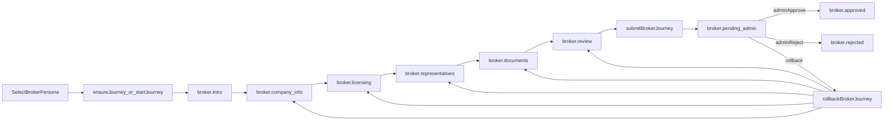
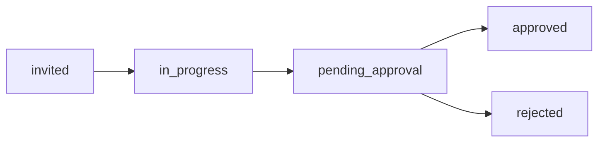
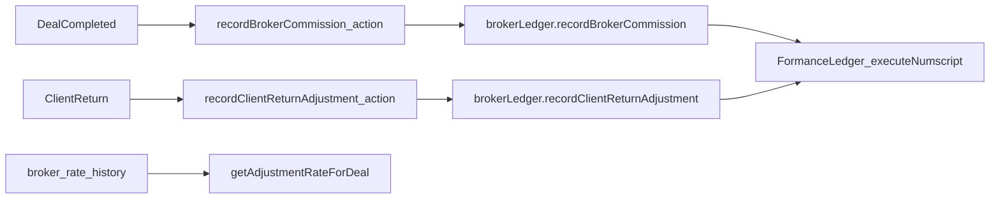
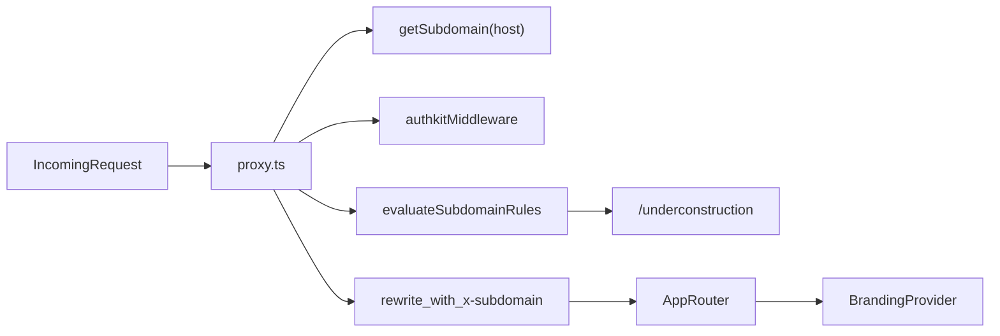
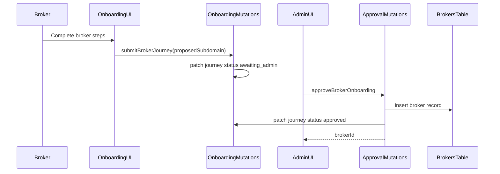
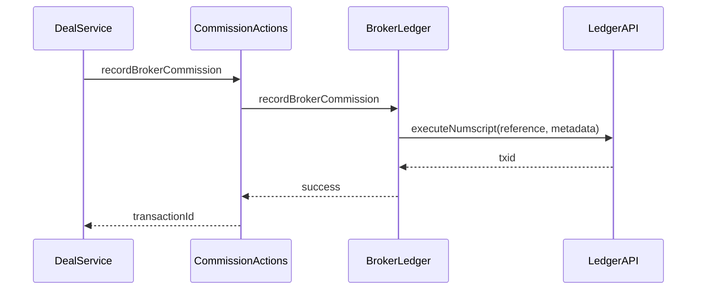

# Broker Onboarding Documentation

## Scope

This document covers the broker onboarding change set in `openspec/changes/add-broker-onboarding` and its implemented code paths: onboarding state machine, admin approval, broker portal, client management, commissions, branding, and subdomain routing.

## Key Files (Implementation Map)

- [components/onboarding/OnboardingExperience.tsx](/Users/connor/Dev/flpilot/components/onboarding/OnboardingExperience.tsx)
- [components/onboarding/machine.ts](/Users/connor/Dev/flpilot/components/onboarding/machine.ts)
- [convex/brokers/onboarding.ts](/Users/connor/Dev/flpilot/convex/brokers/onboarding.ts)
- [convex/brokers/approval.ts](/Users/connor/Dev/flpilot/convex/brokers/approval.ts)
- [convex/brokers/management.ts](/Users/connor/Dev/flpilot/convex/brokers/management.ts)
- [convex/brokers/clients.ts](/Users/connor/Dev/flpilot/convex/brokers/clients.ts)
- [convex/brokers/communication.ts](/Users/connor/Dev/flpilot/convex/brokers/communication.ts)
- [convex/brokers/stats.ts](/Users/connor/Dev/flpilot/convex/brokers/stats.ts)
- [convex/brokers/commissions.ts](/Users/connor/Dev/flpilot/convex/brokers/commissions.ts)
- [convex/brokers/commissions_actions.ts](/Users/connor/Dev/flpilot/convex/brokers/commissions_actions.ts)
- [convex/brokers/commissions_internal.ts](/Users/connor/Dev/flpilot/convex/brokers/commissions_internal.ts)
- [convex/lib/brokerLedger.ts](/Users/connor/Dev/flpilot/convex/lib/brokerLedger.ts)
- [contexts/BrandingContext.tsx](/Users/connor/Dev/flpilot/contexts/BrandingContext.tsx)
- [components/navigation/EntityLink.tsx](/Users/connor/Dev/flpilot/components/navigation/EntityLink.tsx)
- [lib/subdomains.ts](/Users/connor/Dev/flpilot/lib/subdomains.ts)
- [lib/routing/subdomainRules.ts](/Users/connor/Dev/flpilot/lib/routing/subdomainRules.ts)
- [proxy.ts](/Users/connor/Dev/flpilot/proxy.ts)
- [convex/schema.ts](/Users/connor/Dev/flpilot/convex/schema.ts)
- [app/(auth)/dashboard/admin/brokers/managed/page.tsx](</Users/connor/Dev/flpilot/app/(auth)/dashboard/admin/brokers/managed/page.tsx>)
- [app/(auth)/dashboard/broker/clients/page.tsx](</Users/connor/Dev/flpilot/app/(auth)/dashboard/broker/clients/page.tsx>)
- [app/(auth)/dashboard/broker/commissions/page.tsx](</Users/connor/Dev/flpilot/app/(auth)/dashboard/broker/commissions/page.tsx>)

## System Overview

The broker onboarding capability adds:

- A broker-specific onboarding journey stored in `onboarding_journeys`.
- Admin review, approval, rejection, and rollback tooling.
- A broker portal with client management and commissions views.
- Commission accounting modeled with Formance ledger helpers.
- Branding and subdomain-aware routing for white-labeled portals.

## Data Model Additions

All schema additions live in [convex/schema.ts](/Users/connor/Dev/flpilot/convex/schema.ts).

### `onboarding_journeys`

Broker onboarding is stored under `context.broker`:

- `companyInfo`: name, entityType, registrationNumber, registeredAddress, business contact
- `licensing`: licenseType, licenseNumber, issuer, issuedDate, expiryDate, jurisdictions
- `representatives`: array of team members
- `documents`: storageId, label, type, uploadedAt
- `adminRequestTimeline`: admin follow-ups and broker responses
- `proposedSubdomain`

Lifecycle fields:

- `persona`, `stateValue`, `status`, `adminDecision`, `lastTouchedAt`

### `brokers`

Approved broker configuration:

- `userId`, `workosOrgId`, `subdomain`
- `branding`: logo, primaryColor, secondaryColor, brandName
- `commission`: `ratePercentage`, `returnAdjustmentPercentage`
- `status`: active | suspended | revoked
- `approvedAt`, `createdAt`, `updatedAt`

### `broker_clients`

Broker-client relationship and onboarding:

- `brokerId`, `clientId`, `workosOrgId`
- `filters.constraints` (broker-set limits)
- `filters.values` (client-selected values)
- `returnAdjustmentPercentage`
- `onboardingStatus`: invited | in_progress | pending_approval | approved | rejected
- `invitedAt`, `approvedAt`, `createdAt`, `updatedAt`

### `broker_rate_history`

Historical rate changes:

- `type`: commission | return_adjustment
- `oldRate`, `newRate`, `effectiveAt`, `changedBy`, `createdAt`

### `communication_timeline`

Broker-client communication records:

- `clientBrokerId`, `sentBy`, `type`, `message`, `documents`
- `resolved`, `resolvedAt`, `response`, `responseDocuments`
- `sentAt`, `createdAt`

## Onboarding Flow (Mermaid)



### Key Implementation Points

- State machine definitions in [components/onboarding/machine.ts](/Users/connor/Dev/flpilot/components/onboarding/machine.ts).
- UI orchestration in [components/onboarding/OnboardingExperience.tsx](/Users/connor/Dev/flpilot/components/onboarding/OnboardingExperience.tsx).
- Mutations in [convex/brokers/onboarding.ts](/Users/connor/Dev/flpilot/convex/brokers/onboarding.ts).
- Approval and rollback in [convex/brokers/approval.ts](/Users/connor/Dev/flpilot/convex/brokers/approval.ts).

## Client Lifecycle (Mermaid)



### Key Implementation Points

- Client lifecycle logic in [convex/brokers/clients.ts](/Users/connor/Dev/flpilot/convex/brokers/clients.ts).
- Broker portal list in [app/(auth)/dashboard/broker/clients/page.tsx](</Users/connor/Dev/flpilot/app/(auth)/dashboard/broker/clients/page.tsx>).

## Commission and Ledger Flow (Mermaid)



### Key Implementation Points

- Actions wrapper: [convex/brokers/commissions_actions.ts](/Users/connor/Dev/flpilot/convex/brokers/commissions_actions.ts)
- Ledger helpers: [convex/lib/brokerLedger.ts](/Users/connor/Dev/flpilot/convex/lib/brokerLedger.ts)
- Rate history queries: [convex/brokers/commissions_internal.ts](/Users/connor/Dev/flpilot/convex/brokers/commissions_internal.ts)

## Subdomain Routing and Branding (Mermaid)



### Key Implementation Points

- Subdomain parsing in [lib/subdomains.ts](/Users/connor/Dev/flpilot/lib/subdomains.ts).
- Rule engine in [lib/routing/subdomainRules.ts](/Users/connor/Dev/flpilot/lib/routing/subdomainRules.ts).
- Subdomain rewrite and auth handling in [proxy.ts](/Users/connor/Dev/flpilot/proxy.ts).
- Branding state in [contexts/BrandingContext.tsx](/Users/connor/Dev/flpilot/contexts/BrandingContext.tsx).
- Subdomain-aware links in [components/navigation/EntityLink.tsx](/Users/connor/Dev/flpilot/components/navigation/EntityLink.tsx).

## Sequence Diagrams

### Broker Approval



### Commission Recording



## Component Hierarchies

### Onboarding Experience

Source: [components/onboarding/OnboardingExperience.tsx](/Users/connor/Dev/flpilot/components/onboarding/OnboardingExperience.tsx)

```
OnboardingExperience
├─ PersonaSelector
├─ BrokerProgress
├─ BrokerFlowRouter
│  ├─ BrokerIntroStep
│  ├─ BrokerCompanyInfoForm
│  ├─ BrokerLicensingForm
│  ├─ BrokerRepresentativesForm
│  ├─ BrokerDocumentsStep
│  ├─ BrokerReviewStep
│  ├─ BrokerPendingAdminStep
│  └─ BrokerRejectedStep
├─ InvestorProgress
└─ InvestorFlowRouter
   ├─ InvestorIntroStep
   ├─ InvestorProfileForm
   ├─ InvestorPreferencesForm
   ├─ InvestorKycStub
   ├─ InvestorDocumentsStep
   └─ InvestorReviewStep
```

### Admin Managed Brokers

Source: [app/(auth)/dashboard/admin/brokers/managed/page.tsx](</Users/connor/Dev/flpilot/app/(auth)/dashboard/admin/brokers/managed/page.tsx>)

```
ManagedBrokersPage
├─ KPI Cards
├─ Search + Status Filter
└─ BrokerCard (list)
```

### Broker Client Management

Source: [app/(auth)/dashboard/broker/clients/page.tsx](</Users/connor/Dev/flpilot/app/(auth)/dashboard/broker/clients/page.tsx>)

```
BrokerClientsPage
├─ KPI Cards
├─ Search + Status Filter
└─ ClientCard (list)
```

### Broker Commissions

Source: [app/(auth)/dashboard/broker/commissions/page.tsx](</Users/connor/Dev/flpilot/app/(auth)/dashboard/broker/commissions/page.tsx>)

```
CommissionsPage
├─ Total Commissions
├─ YTD
└─ Commission Rate
```

## Core Convex APIs

### Broker Onboarding

File: [convex/brokers/onboarding.ts](/Users/connor/Dev/flpilot/convex/brokers/onboarding.ts)

- `startBrokerJourney`
- `saveBrokerCompanyInfo`
- `saveBrokerLicensing`
- `saveBrokerRepresentatives`
- `saveBrokerDocuments`
- `submitBrokerJourney`
- `getMyBrokerJourney`

### Admin Review and Rollback

File: [convex/brokers/approval.ts](/Users/connor/Dev/flpilot/convex/brokers/approval.ts)

- `listPendingBrokerJourneys`
- `reviewBrokerJourney`
- `sendAdminFollowUp`
- `respondToAdminRequest`
- `approveBrokerOnboarding`
- `rejectBrokerOnboarding`
- `rollbackBrokerJourney`

### Broker Management

File: [convex/brokers/management.ts](/Users/connor/Dev/flpilot/convex/brokers/management.ts)

- `getBrokerByUserId`
- `getBrokerBySubdomain`
- `listBrokers`
- `updateBrokerConfiguration`
- `suspendBroker`
- `revokeBroker`
- `reactivateBroker`
- `updateBrokerCommissionRates`
- `getBrokerRateHistory`

### Client Management

File: [convex/brokers/clients.ts](/Users/connor/Dev/flpilot/convex/brokers/clients.ts)

- `createClientOnboarding`
- `saveClientProfile`
- `submitClientForApproval`
- `approveClient`
- `rejectClient`
- `updateClientFilters`
- `switchClientBroker`
- `revokeClient`

### Commissions

Files:

- [convex/brokers/commissions.ts](/Users/connor/Dev/flpilot/convex/brokers/commissions.ts)
- [convex/brokers/commissions_actions.ts](/Users/connor/Dev/flpilot/convex/brokers/commissions_actions.ts)
- [convex/brokers/commissions_internal.ts](/Users/connor/Dev/flpilot/convex/brokers/commissions_internal.ts)
- [convex/lib/brokerLedger.ts](/Users/connor/Dev/flpilot/convex/lib/brokerLedger.ts)

### Communication Timeline

File: [convex/brokers/communication.ts](/Users/connor/Dev/flpilot/convex/brokers/communication.ts)

- `getClientCommunicationTimeline`
- `getCommunicationEntry`
- `getClientUnresolvedRequestsCount`
- `getBrokerUnresolvedRequestsCount`

## Best Practices and Review Checklist

### Authorization and RBAC

- All broker/admin mutations and queries use `createAuthorizedQuery`/`createAuthorizedMutation`.
- Client invite and approval paths verify broker ownership and role checks.
- Admin-only operations: approval, rollback, broker suspension/revocation, rate changes.

### State Consistency

- Each onboarding mutation updates `stateValue` and `lastTouchedAt`.
- Submission requires required fields and at least one document.
- Rollback clears post-rollback data but preserves `adminRequestTimeline`.

### Ledger Safety

- Ledger interactions live in actions only (`"use node"`).
- Idempotency references are generated in [convex/lib/brokerLedger.ts](/Users/connor/Dev/flpilot/convex/lib/brokerLedger.ts).
- Commission and adjustment calculations are centralized and validated.

### Subdomain Handling

- Subdomains are parsed server-side from host and passed via `x-subdomain` header.
- Subdomain rules are centralized in [lib/routing/subdomainRules.ts](/Users/connor/Dev/flpilot/lib/routing/subdomainRules.ts).
- `BrandingProvider` applies tenant branding via context.

### Known Placeholders (Intentional)

- Commission summary/history queries currently return placeholder data.
- Communication timeline queries return placeholders until table usage is fully wired.
- WorkOS provisioning in broker/client flows is marked TODO in mutations.

## Component-Based Spec Alignment

The OpenSpec additions include a component-based path (`files-control`, `workflow`, `resend`, `rate-limiter`, `crons`) in:

- [SPEC_WITH_COMPONENTS.md](/Users/connor/Dev/flpilot/openspec/changes/add-broker-onboarding/SPEC_WITH_COMPONENTS.md)
- [spec-components.md](/Users/connor/Dev/flpilot/openspec/changes/add-broker-onboarding/specs/broker-onboarding/spec-components.md)

The current codebase implements the manual path (direct storage IDs, synchronous approval mutations, placeholder notifications). When migrating to components, ensure:

- Document uploads and downloads are gated via access keys and download grants.
- Approval transitions are performed via durable workflows with event-driven resumption.
- Email notifications use Resend component with retries and event hooks.
- Public endpoints add rate limits for subdomain checks and uploads.

## Review Summary

This change set introduces a broker persona onboarding flow, admin approvals, broker portal, client management, and commission tracking scaffolding. Core best practices (authorization, state validation, and ledger safety boundaries) are in place, while integrations for WorkOS provisioning, communication timeline persistence, and Formance data caching remain as documented TODOs.
