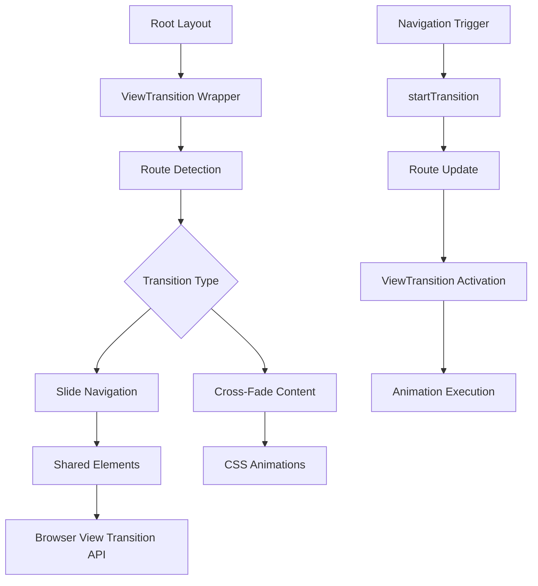

# React 19 View Transitions Implementation Plan

## Overview

This plan outlines the implementation of React 19's new View Transitions API to add smooth page transitions throughout the Next.js application. The implementation will leverage the experimental `<ViewTransition>` component with custom CSS animations for enhanced user experience.

## Current State Analysis

- **React Version**: 19.0.0 (already installed)
- **Next.js Version**: 16.0.0 with App Router
- **Current Navigation**: Standard Next.js Link components without transitions
- **Key Routes**: Home, Listings, Listing Detail, Dashboard, Server pages
- **Current Transitions**: None (using standard navigation)

## Implementation Architecture



## Phase 1: Foundation Setup

### 1.1 Upgrade React Dependencies
- Update `package.json` to use `react@experimental` and `react-dom@experimental`
- Verify compatibility with existing components
- Create fallback for production environment

### 1.2 Create ViewTransition Wrapper Component
- Location: `components/transitions/ViewTransitionWrapper.tsx`
- Purpose: Central wrapper for all page transitions
- Features:
  - Route detection and transition type selection
  - Integration with Next.js App Router
  - Support for custom transition types
  - Performance optimization

## Phase 2: Transition Types Implementation

### 2.1 Slide Transitions for Navigation
- **Use Case**: Main navigation between pages (Home ↔ Listings ↔ Detail)
- **Animation**: Horizontal slide based on navigation direction
- **Implementation**: Custom CSS with `::view-transition-old` and `::view-transition-new`

### 2.2 Cross-Fade for Content Changes
- **Use Case**: Content updates within the same page
- **Animation**: Smooth cross-fade between old and new content
- **Implementation**: Default browser cross-fade with custom timing

### 2.3 Shared Element Transitions
- **Use Case**: Listing cards transitioning between grid and detail views
- **Animation**: Morphing animation for shared elements
- **Implementation**: Named ViewTransitions with matching `name` props

## Phase 3: Route-Specific Implementation

### 3.1 Main Routes with Transitions
- **Home Page**: Slide transition from/to other routes
- **Listings Page**: Cross-fade for filter changes
- **Listing Detail**: Slide transition with shared card elements
- **Dashboard**: Slide transition for navigation

### 3.2 Excluded Routes
- **Error Pages**: No transitions (instant display)
- **Loading States**: No transitions (skeleton states)
- **Modals/Popups**: No transitions (overlay patterns)

## Phase 4: Component Integration

### 4.1 Update Navigation Components
- Modify `components/Header.tsx` to use `startTransition` for navigation
- Update `components/breadcrumb-nav.tsx` to work with ViewTransition wrapper
- Enhance `components/listing-card-horizontal.tsx` with shared element support

### 4.2 Layout Integration
- Update `app/layout.tsx` to include ViewTransition wrapper
- Ensure proper Suspense boundaries for loading states
- Maintain SEO and accessibility during transitions

## Phase 5: Styling and Performance

### 5.1 CSS Animation Framework
- Create `app/globals.css` additions for view transitions
- Define custom animation variants (slide-left, slide-right, cross-fade)
- Implement responsive animation behavior

### 5.2 Performance Optimization
- Minimize layout shifts during transitions
- Optimize for mobile and desktop
- Ensure smooth 60fps animations

## Phase 6: Testing and Documentation

### 6.1 Cross-Browser Testing
- Test in Chrome, Firefox, Safari, Edge
- Verify fallback behavior for unsupported browsers
- Performance testing on various devices

### 6.2 Documentation
- Update component documentation with transition examples
- Create usage guidelines for developers
- Document best practices and patterns

## Technical Implementation Details

### ViewTransition Wrapper Component
```typescript
interface ViewTransitionWrapperProps {
  children: React.ReactNode;
  type?: 'slide' | 'cross-fade' | 'none';
  sharedElements?: string[];
  className?: string;
}

// Key features:
// - Route change detection
// - Transition type selection
// - Shared element naming
// - Performance optimization
```

### CSS Animation Classes
```css
/* Slide transitions */
::view-transition-old(slide-left) {
  animation: 300ms ease-out slide-out-left;
}

::view-transition-new(slide-left) {
  animation: 300ms ease-in slide-in-right;
}

::view-transition-old(slide-right) {
  animation: 300ms ease-out slide-out-right;
}

::view-transition-new(slide-right) {
  animation: 300ms ease-in slide-in-left;
}

/* Cross-fade transitions */
::view-transition-old(cross-fade) {
  animation: 250ms ease-out fade-out;
}

::view-transition-new(cross-fade) {
  animation: 250ms ease-in fade-in;
}

/* Shared element transitions */
::view-transition-old(shared-listing-card) {
  opacity: 0;
  transform: scale(0.8);
}

::view-transition-new(shared-listing-card) {
  opacity: 1;
  transform: scale(1);
}
```

### Navigation Integration Pattern
```typescript
// Enhanced navigation with startTransition
const navigateWithTransition = (url: string) => {
  startTransition(() => {
    router.push(url);
  });
};

// Usage in components
<Link href={url} onClick={() => navigateWithTransition(url)}>
  Content
</Link>
```

## Benefits of This Implementation

1. **Enhanced User Experience**: Smooth, native-feeling transitions
2. **Performance**: Hardware-accelerated animations via browser API
3. **Accessibility**: Proper ARIA support and reduced motion preferences
4. **Developer Experience**: Declarative, easy-to-use API
5. **Future-Proof**: Using latest React 19 experimental features

## Migration Strategy

1. **Experimental Phase**: Use `react@experimental` for testing
2. **Stabilization**: Migrate to stable React 19 when ViewTransitions is stable
3. **Rollback Plan**: Feature flags for quick disabling if issues arise
4. **Monitoring**: Performance metrics and error tracking

## Success Metrics

- **Transition Smoothness**: 60fps animations on target devices
- **Page Load Time**: No significant impact on initial load
- **User Interaction**: Smooth response to navigation actions
- **Cross-Browser Compatibility**: Graceful degradation on older browsers